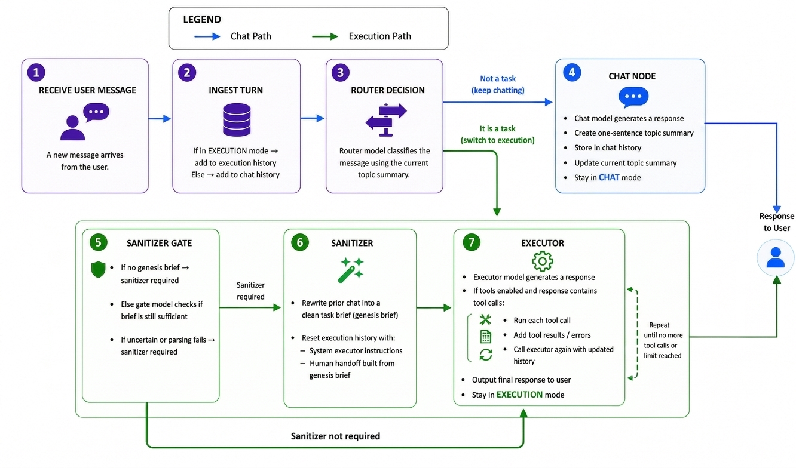

# langgraph-persuasion-guard

Provider-agnostic persuasion guard built with LangChain and LangGraph.

Implementation code lives under `src/langgraph_persuasion_guard`.

## Project Overview

Problem context: when an agent is belief-prefilled at task time, it may explore less and become less objective. Reported results from [Understanding Persuasion in Long-Running Agents](https://arxiv.org/abs/2602.00851) show that belief-prefilled agents perform 26.9% fewer searches and visit 16.9% fewer unique sources than neutral-prefilled agents. This suggests prior persuasion can materially influence downstream agent behavior.

This project aims to mitigate that problem by routing execution through a guarded flow (including sanitization when needed) so task behavior is less vulnerable to prior persuasive framing.

## Proposed Solution

`langgraph-persuasion-guard` is a stateful LangGraph agent that separates normal conversation from task execution.

The graph maintains a shared state (`PersuasionGuardState`) and routes each user turn into one of two modes:

- `CHAT`: regular assistant conversation with topic continuity.
- `EXECUTION`: task-oriented execution flow with an optional sanitization step before execution.

Core goals:

- Keep conversational context (`chat_history`, `current_topic_summary`) for normal dialogue.
- Isolate execution context (`execution_history`) for task-follow-up turns.
- Add a sanitizer gate that can enforce safer execution handoffs.
- Support model/provider overrides by role (`router`, `sanitizer`, `executor`, `chat`).

## How `graph.py` Works



The graph is assembled from six nodes:

- `ingest_turn_node`: normalizes incoming input into graph state.
- `router_node`: decides whether the turn is chat or execution.
- `sanitizer_gate_node`: decides whether sanitization is required for execution.
- `sanitizer_node`: builds a "genesis brief" / sanitized handoff instruction.
- `executor_node`: performs execution-style response generation (and optional tool use).
- `chat_node`: handles normal chat responses.

Routing logic in simple terms:

1. Start at `ingest_turn_node`.
2. If you are already in execution mode and the newest execution message is from the user, skip re-routing and continue execution directly.
3. Otherwise run the router:
   - If router says "execution", go to sanitizer gate.
   - If router says "chat", go to chat node and finish.
4. In execution flow:
   - If sanitizer is required, run sanitizer first, then executor.
   - If not required, go straight to executor.
5. End after `chat_node` or `executor_node`.

Other key behavior in `graph.py`:

- It requires four role models: `router`, `sanitizer`, `executor`, `chat`.
- If tools are provided, they are bound to the executor model (when the model supports `bind_tools`).
- It compiles the graph with a checkpointer. If you do not pass one, it uses in-memory checkpointing (`InMemorySaver`).
- `create_persuasion_guard(...)` is a convenience wrapper around `build_persuasion_guard_graph(...)`.

## Install Required Libraries

### Option A: Install from this repository (recommended for development)

```bash
pip install -e .
```

This installs the package from source using dependencies in `pyproject.toml`.

### Option B: Install explicit requirements file

```bash
pip install -r requirements.txt
```

Note: `requirements.txt` in this repo currently includes OpenAI-specific extras for the demo.

### Provider-specific dependencies

Core package dependencies are provider-agnostic. Install provider integrations you need, for example:

```bash
pip install "langgraph-persuasion-guard[providers]"
```

That extra includes currently listed provider packages:

- `langchain-openai`
- `langchain-anthropic`
- `langchain-google-genai`
- `langchain-aws`

## Install From Pip

The package is published on PyPI here:

- https://pypi.org/project/langgraph-persuasion-guard/0.1.0/

Install version `0.1.0` with:

```bash
pip install langgraph-persuasion-guard==0.1.0
```

Install latest with:

```bash
pip install langgraph-persuasion-guard
```

For provider integrations at install time:

```bash
pip install "langgraph-persuasion-guard[providers]"
```

## Configure The Agent (Detailed)

You can configure models in three layers (highest priority first):

1. `role_model_overrides` argument in Python
2. Role-specific environment variables (`ROUTER_*`, `SANITIZER_*`, `EXECUTOR_*`, `CHAT_*`)
3. Global defaults (`default_model`/`default_provider` args or `MODEL_NAME`/`MODEL_PROVIDER` env)

`chat_max_tokens` is a special override applied only to the `chat` role.

### Minimum Python-only configuration (no env vars)

```python
from langgraph_persuasion_guard import create_persuasion_guard

agent = create_persuasion_guard(
    default_model="gpt-4o-mini",
    default_provider="openai",
    chat_max_tokens=512,
    use_env=False,
)
```

### Full role override configuration

```python
from langgraph_persuasion_guard import RoleModelConfig, create_persuasion_guard

agent = create_persuasion_guard(
    default_model="gpt-4o-mini",          # fallback if a role is not overridden
    default_provider="openai",            # fallback provider if a role is not overridden
    max_tool_round_trips=8,                # max tool-call loops in executor node
    chat_max_tokens=768,                   # force chat role max_tokens
    use_env=True,                          # allow env vars to be read
    role_model_overrides={
        "router": RoleModelConfig(
            model="gpt-4o-mini",
            model_provider="openai",
            temperature=0.0,
            max_tokens=256,
        ),
        "sanitizer": RoleModelConfig(
            model="gpt-4o-mini",
            model_provider="openai",
            temperature=0.2,
            max_tokens=512,
        ),
        "executor": RoleModelConfig(
            model="gpt-4o-mini",
            model_provider="openai",
            temperature=0.0,
            max_tokens=1024,
        ),
        "chat": RoleModelConfig(
            model="gpt-4o",
            model_provider="openai",
            temperature=0.7,
            max_tokens=1024,
        ),
    },
)
```

### Environment variable reference

Global:

- `MODEL_NAME`
- `MODEL_PROVIDER`

Per-role (replace `<ROLE>` with `ROUTER`, `SANITIZER`, `EXECUTOR`, `CHAT`):

- `<ROLE>_MODEL_NAME`
- `<ROLE>_MODEL_PROVIDER`
- `<ROLE>_TEMPERATURE`
- `<ROLE>_MAX_TOKENS`

Example:

```bash
export MODEL_NAME=gpt-4o-mini
export MODEL_PROVIDER=openai
export ROUTER_TEMPERATURE=0.0
export SANITIZER_TEMPERATURE=0.2
export EXECUTOR_MAX_TOKENS=1200
export CHAT_MODEL_NAME=gpt-4o
export CHAT_MAX_TOKENS=800
```

PowerShell equivalent:

```powershell
$env:MODEL_NAME = "gpt-4o-mini"
$env:MODEL_PROVIDER = "openai"
$env:ROUTER_TEMPERATURE = "0.0"
$env:SANITIZER_TEMPERATURE = "0.2"
$env:EXECUTOR_MAX_TOKENS = "1200"
$env:CHAT_MODEL_NAME = "gpt-4o"
$env:CHAT_MAX_TOKENS = "800"
```

### Behavior notes

- If no model can be resolved for any role, construction raises `ValueError`.
- Default temperatures (when not explicitly set) are:
  - `router=0.0`
  - `sanitizer=0.2`
  - `executor=0.0`
  - `chat=0.7`
- `use_env=False` disables all environment-variable reads.

## Using Tools

You can pass LangChain tools into `create_persuasion_guard(...)`.  
The graph binds tools to the `executor` model and executes tool calls during execution turns.

### Example: single tool

```python
from langchain_core.messages import HumanMessage
from langchain_core.tools import tool
from langgraph_persuasion_guard import create_persuasion_guard

@tool
def add_numbers(a: int, b: int) -> int:
    """Add two integers."""
    return a + b

agent = create_persuasion_guard(
    default_model="gpt-4o-mini",
    default_provider="openai",
    tools=[add_numbers],
)

result = agent.invoke(
    {
        "chat_history": [
            HumanMessage(content="Calculate 17 + 25 using the tool.")
        ]
    },
    {"configurable": {"thread_id": "tools-demo-1"}},
)
```

### Example: multiple tools + tool round-trip limit

```python
from langchain_core.messages import HumanMessage
from langchain_core.tools import tool
from langgraph_persuasion_guard import create_persuasion_guard

@tool
def multiply(a: int, b: int) -> int:
    """Multiply two integers."""
    return a * b

@tool
def get_today_iso() -> str:
    """Return today's date in ISO format."""
    from datetime import date
    return date.today().isoformat()

agent = create_persuasion_guard(
    default_model="gpt-4o-mini",
    default_provider="openai",
    tools=[multiply, get_today_iso],
    max_tool_round_trips=4,  # stop after 4 tool-call loops
)

result = agent.invoke(
    {
        "chat_history": [
            HumanMessage(
                content=(
                    "Use tools to compute 12 * 9, then include today's date in the answer."
                )
            )
        ]
    },
    {"configurable": {"thread_id": "tools-demo-2"}},
)
```

### Tool behavior notes

- Tools run only in `EXECUTION` flow (not regular `CHAT` responses).
- If the model requests a tool that is not provided, the graph returns a tool error message internally.
- `tool_call_count` is stored in the returned state for execution turns.

## Quick Start

```bash
pip install -e .
python examples/run_demo.py
```
